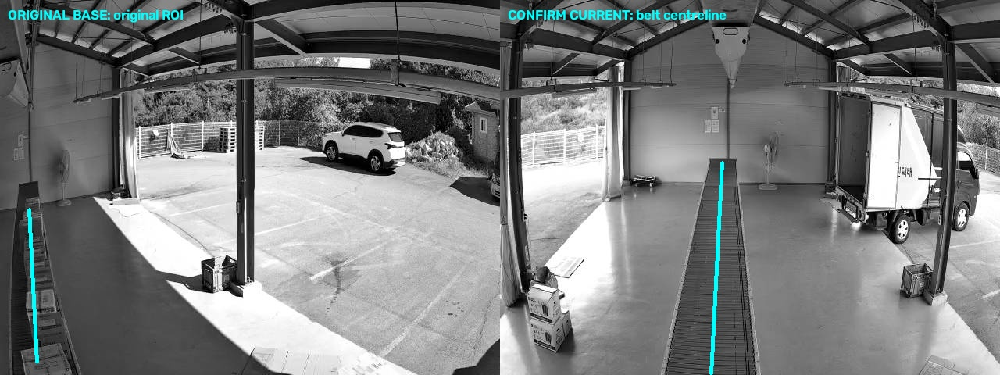

# CAM4: 최초 BASE → confirm 중앙선 재구성

## 최신 변경: SIFT ROI를 유지하고 경계로 추가 검증

인라이어 하한을 10개/45%로 적용했다. `roi_change_apply`에서 SIFT 후보가 대응점 수·비율, 재투영 오차, 분포, 화면 경계, projective horizon 및 위치별 확대/뒤집힘 검사를 모두 통과하고 **ROI 주변 대응점 지지 조건만 부족할 때**, BASE와 현재 영상의 벨트 경계로 추가 검증한다. 일반 polygon/복수 ROI에는 적용하지 않는다.

새 검증 함수 `validate_conveyor_projection`은 SIFT가 변환한 선을 9개 위치에서 검사한다. 각 위치가 검출된 벨트 중앙에서 640px 기준 8px 및 해당 폭의 20% 이내여야 하며, 관측된 경계 길이를 35px 이상 벗어나면 거부한다. 변환 행렬, 끝점, 선의 길이를 변경하지 않는다. 이 검증에 실패하면 기존 후순위 중앙선 재구성 경로는 남아 있다.

최초 BASE→confirm 직접 시험: **SIFT 10/21개(47.6%), 재투영 오차 p90 1.71px, 검출 경계 중앙과 최대 차이 2.54px**로 승인됐다. 좌표는 기존 SIFT 결과 그대로 `[[272,462],[285,241]]`, 적용 방법은 `homography`다. 중앙선을 다시 만드는 함수를 사용하지 않았다. 이 2.54px는 검출 경계에 대한 차이로 실측 정답 오차를 뜻하지 않는다.

재현: `python artifacts/roi_review_20260907/test_sift_rail_validation.py`. 상세 JSON은 `SIFT_rail_validation_result.json`, 이미지는 `CAM4_SIFT_verified_by_rails.png`. 테스트 46개 실행: 45개 통과/1개 건너뜀. 행렬 불변, 잘못 이동한 선/경계 없는 영상 거부, 다른 homography 검증의 우회 금지, 실제 Camera 블록의 homography 적용을 포함한다.

SIFT 후보가 이 경로로 승인되면 기존 homography 적용 규칙을 따르므로 **3회 suspect 뒤 해당 검사에서 적용**한다. 후순위 중앙선 재구성에만 적용하는 두 관측 대기는 이 경로에 적용되지 않는다. 관제 확인 전 감지 중단 정책은 유지하며 단말에는 배포하지 않았다. 아래 내용은 이전 중앙선 재구성 단계의 기록이다.

## 후속 수정: suspect 단일 이상 판정

방향·코사인 검사를 제거했다. 측정 정족수가 확보되고 모든 측정 칸이 7.5px를 초과하면 이동 방향과 무관하게 suspect다. 연속 3회 suspect에서 confirm 및 최초 BASE→현재 영상 보정을 시도한다. 중간 normal은 연속 횟수를 초기화한다. 기존 2/3 자격 조건과 ORB 경로를 제거했다.

중앙선 재구성은 `roi_change_apply` 이벤트로 실행하며 `conveyor_crossing` 이벤트가 필수이지 않다. 단일 ROI 선/빈 polygon 조건, 두 현재 관측의 일치 확인, 관제 확인 대기 정책은 유지한다. 기존 CSV의 disturbed/방향 열은 호환을 위해 0 또는 빈 값으로 남기지만 판정·코사인 계산은 하지 않는다. 테스트는 후속 수정 기준 43개 실행, 42개 통과/1개 건너뜀이다. 최초 BASE→confirm 직접 재현에서도 중앙선 결과 `[[270,478],[284,208]]`을 확인했다.

## 직접 시험 결과

다음 두 파일만 입력했다. `suspect_current`나 UPDATED 앵커는 이 시험에 사용하지 않았다.

- BASE: `CAM4_20260907_182506_suspect_anchor_base.jpg`
- 현재: `CAM4_20260907_183507_confirm_current.jpg`
- 기존 선: `[[47,463],[37,268]]`
- 재구성한 중앙선, 픽셀 반올림: `[[270,478],[284,208]]`

특징점 기반 homography는 기존 검증에서 거부됐다. 추가한 컨베이어 중앙선 재구성 경로는 통과했다. 양쪽 경계 중 낮은 쪽의 관측 구간 비율은 0.89이며, 검사한 단면 모두 양쪽 경계에서 밝기 대비가 확인됐다. 이 수치는 정답 확률을 뜻하지 않는다.



하늘색이 ROI다. 선은 현재 보이는 벨트의 중앙을 따라 재구성하며, 길이도 확인 가능한 벨트 범위로 조정한다. 용도는 사용자가 설명한 사람의 벨트 횡단 감지다. 임의의 두 물리적 지점을 보존하는 정합 기능과 구분한다.

## 왜 특징점 매칭이 실패했는가

검출량과 대응점 수를 혼동했던 초기 분석을 정정한다. SIFT 대비 문턱을 0.01로 낮춘 진단에서 BASE ROI 아래쪽 끝 80px 안에 **111개가 검출**됐다. 그러나 거리 비율 검사는 **2개**, 양방향 검사는 **0개**만 통과했다. 이 구역의 가장 가까운 후보와 두 번째 후보의 거리 비율 중앙값은 약 **0.95**로, 대응 위치를 구별하기 어렵다.

BASE의 벨트에는 상자가 올라가 있고 현재 영상은 대부분 빈 벨트다. 상자 위 특징은 현재 벨트에 같은 대응물이 없으며, 반복 롤러 무늬와 큰 시점 변화도 점의 식별을 어렵게 한다. 천장 등의 점으로 얻은 변환을 아래쪽까지 외삽하면 끝점이 불안정해진다.

시점 보완 15개 조합과 LoFTR의 outdoor/indoor 모델도 오프라인으로 시험했다. Outdoor 모델은 confirm 영상과 780개 대응점을 만들었지만 아래쪽 ROI 끝의 유효 대응점은 여전히 0개였다. 문턱이나 특징점 예산만으로 해결할 문제가 아니었다.

진단용으로 렌즈 왜곡 모델과 경계 제약도 시험했지만, 수동으로 경계의 대응 관계를 지정한 실험을 운영 정합으로 사용하지 않았다. 관련 실험 파일에는 diagnostic임을 명시했다.

## 적용한 수정

`conveyor_roi.py`에서 컨베이어 양쪽의 긴 경계를 각각 검출하고, 그 중간을 횡단용 중앙선으로 만든다. BASE의 기존 선이 경계 쌍 중앙 부근인지 먼저 확인한다. 특징점 변환은 현재 영상의 탐색 위치를 제안하는 용도로만 사용한다.

양쪽 경계의 관측 길이, 폭, 대비, 경쟁 후보를 검사한다. 한쪽 경계만 있거나, 비슷한 후보 벨트가 여러 개거나, 탐색 위치에 따라 중앙선이 달라지면 재구성을 보류한다. 결과 선은 화면 안으로 제한한다. 해상도에 따른 경계 검출 편차를 줄이기 위해 긴 선 검출은 일관된 크기에서 하고 좌표를 입력 해상도로 되돌린다.

`multi_event_irfilter.py`의 자동 보정 블록에 연결했다. `roi_change_apply`의 3회 연속 suspect 자격 조건을 만족한 카메라 중 polygon 없음, ROI 선 한 개인 경우에 사용한다. 일반 polygon이나 여러 선은 중앙선으로 재해석하지 않는다.

**직접 두 파일 시험은 보정 후보 계산을 검증한다. 실제 코드의 적용은 서로 다른 현재 영상 두 관측에서 끝점 차이가 640px 기준 8px 이내일 때 수행한다.** 첫 관측은 대기한다. 별도 통합 시험에서는 최초 BASE를 고정한 채 BASE→suspect, BASE→confirm을 각각 계산하여 첫 번째는 대기, 두 번째는 핸들러에 한 번 적용되는 것을 확인했다. 중간 프레임으로 기준 ROI를 갱신하거나 변환을 누적하지 않았다.

설정 교체 중 계산된 결과를 폐기하고, 동일 프레임 반복으로 확인 횟수가 채워지지 않도록 했다. 기존 관제 확인 전 횡단 감지 중단/설정 대기 정책은 유지했다. 단말 배포·설정 변경은 하지 않았다. 배포 시 주 파일과 `conveyor_roi.py`를 함께 배포해야 한다. 운영 경로의 새 의존성은 없으며 기존 OpenCV/NumPy를 사용한다. Torch/Kornia는 PC의 별도 캐시 환경에서 추가 실험에만 사용했다.

## 검증 및 재현

- 테스트 38개 실행: 37개 통과, 없는 legacy danmal 소스 관련 1개 건너뜀.
- 최초 BASE→confirm 직접 중앙선 계산과 실제 횡단 판정 함수의 교차/비교차 검증.
- 최초 BASE를 고정한 두 현재 영상 관측 후 자동 보정 1회 적용.
- 한쪽 경계만 있는 영상, 단색 영상, 벽의 두 줄, 경쟁 벨트, 큰 좌표 오류, 복수 ROI, 프레임 중복, 위치 불일치, 설정 변경 거부.
- 알려진 사다리꼴 중앙 복원 및 2배 해상도 좌표 검증.
- 관측된 두 현재 영상의 아래쪽 중앙 위치 차이는 약 2.3px. 실제 이동 전후의 물리적 지점 정답 오차나 사람 검출/추적 전체의 정확도를 측정한 결과는 아니다.

```powershell
python artifacts/roi_review_20260907/test_cam4_base_to_confirm.py
python -m unittest discover -s tests
```

직접 시험의 상세 결과는 `CAM4_BASE_to_CONFIRM_result.json`에 있다. 단말 성능과 다른 카메라 장면에서의 성공률은 아직 측정하지 않았다.

실험 방법 참고: [LoFTR 논문](https://openaccess.thecvf.com/content/CVPR2021/papers/Sun_LoFTR_Detector-Free_Local_Feature_Matching_With_Transformers_CVPR_2021_paper.pdf), [OpenCV affine 시점 샘플링 예제](https://github.com/opencv/opencv/blob/4.x/samples/python/asift.py). 최종 중앙선 재구성은 이 모델들을 운영에 추가하지 않고 영상의 관측 경계를 사용한다.
